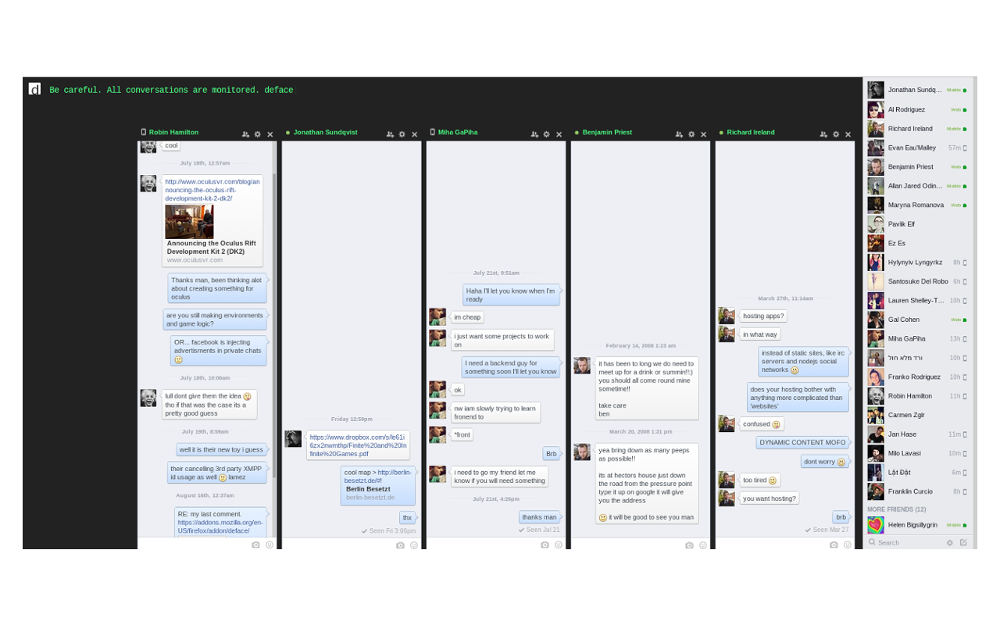

deface removes everything except the chat from Facebook.
It also helps you detox by allowing only 30-second bursts of viewing the stream.

If you don't want to get distracted by Facebook, or throw away your privacy with the mobile messenger apps,
but are still somehow required to use Facebook chat, deface is the solution.

<strong>INSTRUCTIONS</strong>

1.Toggle deface off/on with the icon in the top-left corner(deface will reactivate after 30 seconds)

2.Please log in to Facebook to use deface

Firefox store > https://addons.mozilla.org/en-US/firefox/addon/deface/

Chrome store > https://chrome.google.com/webstore/detail/deface/ihhimmbgggpdandomknjjamhbofgpijj


```

## Heroes
** thanks to the hackership crew and evan **
